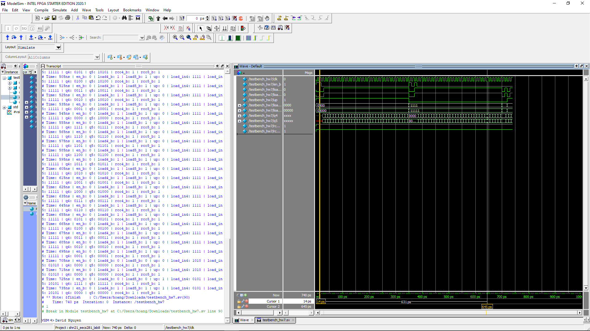

# Up/Down Counter Simulation

## Overview

The `Counter` directory includes SystemVerilog modules for simulating a parameterizable up/down counter. This counter supports loading initial values, counting up or down based on the input signal, and indicating when a roll-over or roll-under condition occurs.

## Files Description

- **`up_down_counter.sv`**: The main module defines the logic for a parameterizable N-bit up/down counter. It features enable, load, and up/down controls along with an N-bit load input and output. The module also provides a roll-over/under output indication (`rco_b`).

- **`testbench_7.sv`**: A testbench module that instantiates the up/down counter with different parameter sizes (4-bit and 5-bit) and applies various test scenarios to verify its functionality. It systematically changes the counter's mode of operation and initial load values to test all functionalities.

## Simulation Setup

### Prerequisites

- A SystemVerilog-compatible simulator (e.g., ModelSim, VCS, or Vivado Simulator).
- Familiarity with digital logic and SystemVerilog simulation environments.

### Running the Simulation

1. **Compile** both `up_down_counter.sv` and `testbench_7.sv` in your simulation environment.
2. **Execute** the `testbench_7` to initiate the simulation.
3. **Monitor** the simulation output for changes in the counter values (`q4`, `q5`), and the roll-over/under indicators (`rco4_b`, `rco5_b`) as the testbench applies different inputs.

## Key Features

- **Parameterizable Width**: The counter's bit-width is customizable through a module parameter, allowing for flexibility in design and application.
- **Up/Down Counting**: Controlled by a single input signal, the counter can either increment or decrement, demonstrating versatility in counting operations.
- **Load Capability**: Enables the counter to be initialized with a specific value at any point during operation, useful for dynamic counting applications.
- **Roll-over/Under Indication**: Provides an output signal to indicate when the counter has rolled over (in up mode) or rolled under (in down mode), essential for detecting boundary conditions.

## Example Usage

The testbench demonstrates several operational scenarios including:
- Initializing the counter with specific values and enabling up/down counting.
- Dynamically switching between up and down modes to observe counting behavior.
- Utilizing the roll-over/under indication to detect when the counter has completed a full cycle.

## Example Test Output

## Contributing

Contributions to enhance or extend the functionality of the up/down counter are welcome. This could include adding features, improving efficiency, or expanding the testbench to cover more scenarios. Please fork the repository, commit your changes, and submit a pull request with a detailed description of your contributions.

## License

This project is provided for educational and non-commercial use. It is freely available for modification and distribution with proper attribution to the original author(s).

---
