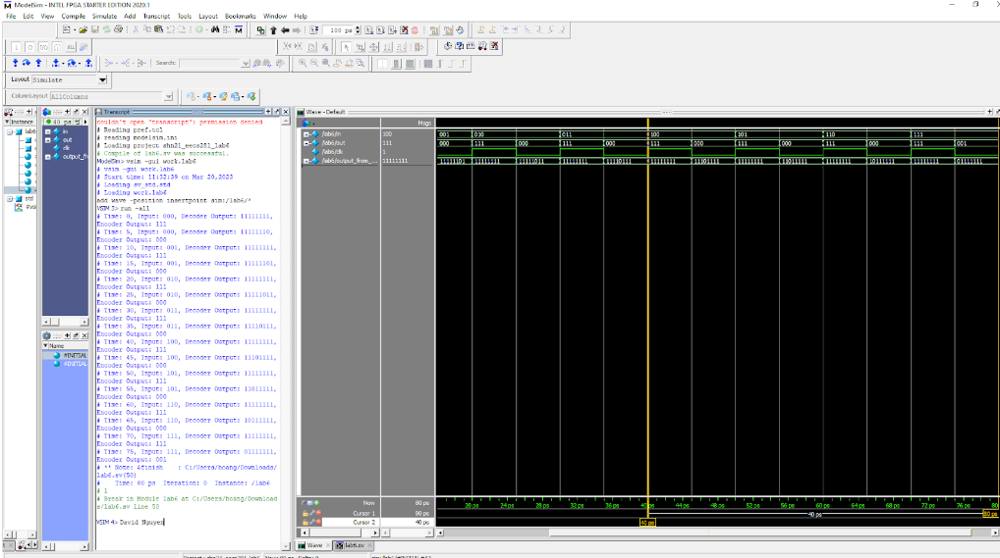

# 3-to-8 Decoder and 8-to-3 Encoder Simulation

## Overview

This directory houses a SystemVerilog module for simulating a 3-to-8 decoder followed by an 8-to-3 encoder. The module showcases the basic principles of digital decoding and encoding, transforming a 3-bit input into an 8-bit output, which is then re-encoded back into a 3-bit representation. This simulation is valuable for understanding digital logic conversion and the operation of decoders and encoders in digital circuits.

## File Description

- **`DecoderEncoder.sv`**: The main simulation module that includes both the decoder and encoder functions. It provides an illustrative example of decoding and encoding processes by converting a 3-bit input to an 8-bit output and then back to a 3-bit output, with the initial and final 3-bit values being identical under ideal conditions.

## Simulation Setup

### Prerequisites

- A SystemVerilog-compatible simulator (e.g., ModelSim, VCS, Vivado Simulator).
- Basic understanding of digital circuits and SystemVerilog.

### Running the Simulation

1. **Compile** the `DecoderEncoder.sv` file in your simulation environment to prepare for simulation.

2. **Execute** the simulation by running the compiled module. Ensure that the simulation time is sufficient to observe multiple decoding and encoding cycles.

3. **Monitor** the simulation output. The module includes `$monitor` commands to display the input to the decoder, the output from the decoder, and the final output from the encoder in real-time.

## Understanding the Module

The simulation module operates in the following manner:

- **Decoding**: Converts a 3-bit input into an 8-bit output based on the predefined logic, where each 3-bit input value selects one of the eight outputs to be active (low in this context).

- **Encoding**: Reverses the process by converting the 8-bit output back into a 3-bit value corresponding to the active output bit's original input value.

The module uses a clock signal to periodically change the input value, demonstrating the dynamic operation of the decoder and encoder.

## Example Output

## Contributing

Contributions to enhance or expand the functionality of the decoder-encoder simulation are welcome. Whether it's optimizing the existing logic, adding new features, or creating additional testbenches for more complex scenarios, your input can significantly improve this educational resource.

## License

This project is made available under a license that permits use, modification, and distribution for educational purposes. Redistribution and use for commercial purposes are not allowed without explicit permission.

---
