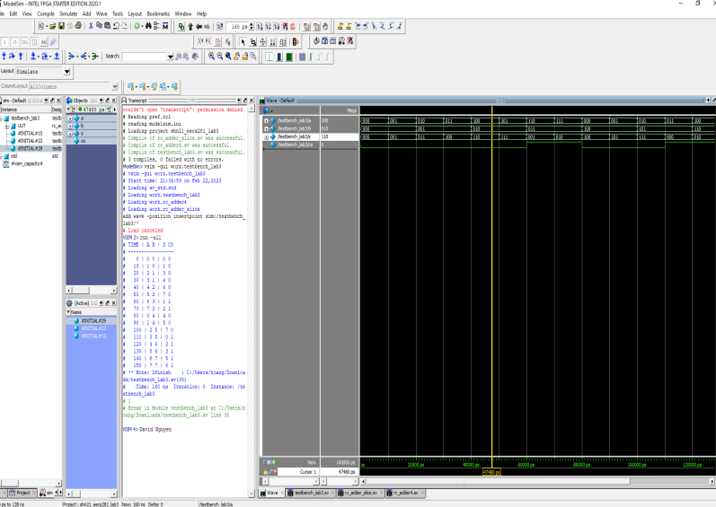

# Ripple-Carry Adder Simulation

## Overview

This directory contains SystemVerilog modules for simulating a ripple-carry adder (RCA), a fundamental digital circuit used for binary addition. This set of modules demonstrates how a ripple-carry adder operates at a bit level by cascading basic adder slices. The simulation includes a 3-bit ripple-carry adder and its constituent adder slice, along with a testbench for verification.

## Contents

The `Ripple-Carry-Adder` directory comprises the following SystemVerilog files:

- **`rc_adder4.sv`**: Implements a 3-bit ripple-carry adder using cascaded adder slices. It takes two 3-bit inputs and produces a 3-bit sum output along with a carry-out bit.

- **`rc_adder_slice.sv`**: Defines a single-bit adder slice, which is the basic building block of the ripple-carry adder. It performs single-bit binary addition with a carry-in and produces a sum bit and a carry-out bit.

- **`testbench_3.sv`**: A testbench for the 3-bit ripple-carry adder, automatically cycling through all possible combinations of inputs to verify the adder's functionality.

## Getting Started

### Prerequisites

- A SystemVerilog-compatible simulation environment, such as ModelSim, Vivado Simulator, or VCS.
- Basic knowledge of digital logic design and SystemVerilog.

### Running Simulations

1. **Setup**: Ensure your simulation toolchain is correctly installed and set up on your system.

2. **Compile**: Compile the ripple-carry adder (`rc_adder4.sv`), the adder slice (`rc_adder_slice.sv`), and the testbench (`testbench_3.sv`). Make sure all files are included in the compilation process.

3. **Run**: Execute the testbench module. The testbench is designed to systematically test every possible input combination for the 3-bit inputs `a` and `b`.

4. **Observe**: Watch the simulation output. The testbench prints the current simulation time, input values `a` and `b`, and the resulting sum `s` along with the carry-out `co` for each test case.

## Understanding the Testbench Output

The testbench output format is designed to be intuitive, displaying the simulation time alongside the input and output values:

```
TIME | A B | S CO
-----------------
...example outputs...
```

This format helps users quickly verify the functionality of the ripple-carry adder against expected results.

## Example Test Output



## Contributing

We welcome contributions to enhance the ripple-carry adder simulation, whether it's refining the existing modules, expanding the testbench, or adding new features. Please fork the repository, commit your changes, and open a pull request detailing your modifications.

## License

The project is available under the MIT License. Please see the LICENSE file in the repository for full details.

---
