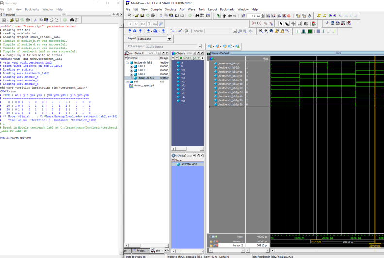

# Verilog Logic Modules

## Overview

This repository contains a collection of Verilog module files that implement basic logic operations: AND, OR, and XOR. Each file represents a unique approach to achieving the same functionality, demonstrating various Verilog coding styles and methodologies for educational purposes. These modules are designed to be simple yet illustrative, making them ideal for learners and professionals looking to deepen their understanding of Verilog and digital logic design.

## Contents

The directory includes the following Verilog files:

- `module_b.sv` - Implements basic logic operations using behavioral modeling with an `always_comb` block.
- `module_d.sv` - Utilizes continuous assignment statements (`assign`) to achieve the logic operations.
- `module_s.sv` - Employs structural modeling with gate-level primitives (`and`, `or`, `xor`) to construct the logic functions.
- `testbench_2.sv` - A comprehensive testbench designed to validate the functionality of the modules by simulating various input combinations and observing the output.

## Getting Started

To use these modules in your project, follow these steps:

1. Clone or download this repository to your local machine.
2. Include the desired Verilog file(s) in your project's Verilog source directory.
3. Instantiate the module(s) in your Verilog design as required. Make sure to connect the input and output ports according to your design's needs.

## Module Interfaces

Each module in this collection has the following interface:

- **Inputs:**
    - `a` : logic signal input
    - `b` : logic signal input
- **Outputs:**
    - `y1` : logic output representing the AND operation between inputs `a` and `b`.
    - `y2` : logic output representing the OR operation between inputs `a` and `b`.
    - `y3` : logic output representing the XOR operation between inputs `a` and `b`.

## Usage Example

Here is a simple instantiation example of `module_b`:

```verilog
module top_module (
    input logic top_a,
    input logic top_b,
    output logic top_y1,
    output logic top_y2,
    output logic top_y3
);

module_b instance_b (
    .a(top_a),
    .b(top_b),
    .y1(top_y1),
    .y2(top_y2),
    .y3(top_y3)
);

endmodule
```

Replace `module_b` with `module_d` or `module_s` as needed for your application.

## Example Test Output



## Contributing

We welcome contributions and suggestions to improve these modules or add new ones. Please feel free to submit issues or pull requests through the repository's issue tracker.

## License

This project is licensed under the MIT License - see the LICENSE file in the repository for details.

---
